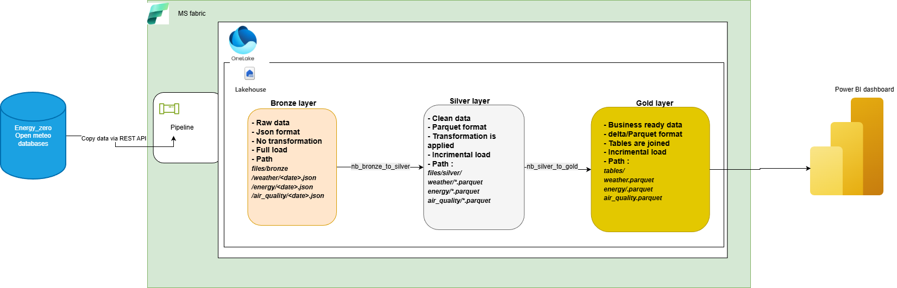

# Smart City / Open-Meteo Data Pipeline on Microsoft Fabric

Electricity prices vary throughout the day. Our (imaginary) customer wants to shift consumption to the cheapest time windows to reduce cost. This solution ingests time-series price data, processes it through Bronze/Silver/Gold layers in Microsoft Fabric, and produces a flagged output indicating when electricity is “cheap” . The curated results are then exposed to Power BI for monitoring and decision support.
This project implements a Microsoft Fabric Lakehouse solution using a medallion (Bronze/Silver/Gold) architecture. Data is ingested via a Fabric Pipeline from REST APIs (Energy / Open-Meteo-style sources), processed with Fabric notebooks, and served to Power BI for reporting.

## Architecture Diagram

## High-Level Flow

1. **Source systems**
   - Energy / Open-Meteo databases exposed via **REST API**.

2. **Ingestion (Fabric Pipeline)**
   - A Fabric **Pipeline** performs **Copy**  activities to pull source data via REST API.
   - Data lands in the **Lakehouse** within **OneLake**.

3. **Bronze Layer (Raw)**
   - Purpose: retain immutable raw extracts for traceability and replay.
   - Format: **JSON**
   - Load pattern: **Full load**
   - Example paths:
     - `files/bronze/weather/<date>.json`
     - `files/bronze/energy/<date>.json`
     - `files/bronze/air_quality/<date>.json`
   - Transformations: **None** (raw landing only)

4. **Silver Layer (Cleaned / Conformed)**
   - Purpose: standardized, clean data suitable for downstream joins and modeling.
   - Format: **Parquet** 
   - Transformations: cleaning + normalization applied
   - Load pattern: **Incremental**
   - Example paths:
     - `files/silver/weather/*.parquet`
     - `files/silver/energy/*.parquet`
     - `files/silver/air_quality/*.parquet`
   - Processing notebook:
     - `nb_bronze_to_silver`

5. **Gold Layer (Business-ready)**
   - Purpose: curated, analytics-ready tables for BI consumption (joined entities, aggregates, KPI-ready).
   - Format: **Delta/Parquet**
   - Load pattern: **Incremental**
   - Example outputs:
     - `tables/weather.parquet`
     - `tables/energy.parquet`
     - `tables/air_quality.parquet`
   - Processing notebook:
     - `nb_silver_to_gold`

6. **Consumption (Power BI)**
   - Power BI dashboard reads from the **Gold** layer  via a semantic model.

## Source Control / CI/CD Notes

This workspace is connected to a Git repository and uses Fabric **Sync** to publish changes from source control into the workspace.  
Git + Sync provides **version control and a deployment mechanism**, but it is **not full CI/CD by itself** because it does not automatically run tests, quality gates, or multi-environment promotions.  
For full CI/CD, add **GitHub Actions/Azure DevOps** to validate changes (CI) and automate deployments across **Dev → Test → Prod** (CD).

## Components

- **Microsoft Fabric**
  - OneLake
  - Lakehouse
  - Pipelines (Data Factory experience in Fabric)
  - Notebooks (Spark)
- **Data Layers**
  - Bronze (raw JSON)
  - Silver (cleaned Parquet/Delta)
  - Gold (business-ready Delta/Parquet)
- **BI**
  - Power BI dashboard (fed from Gold)

